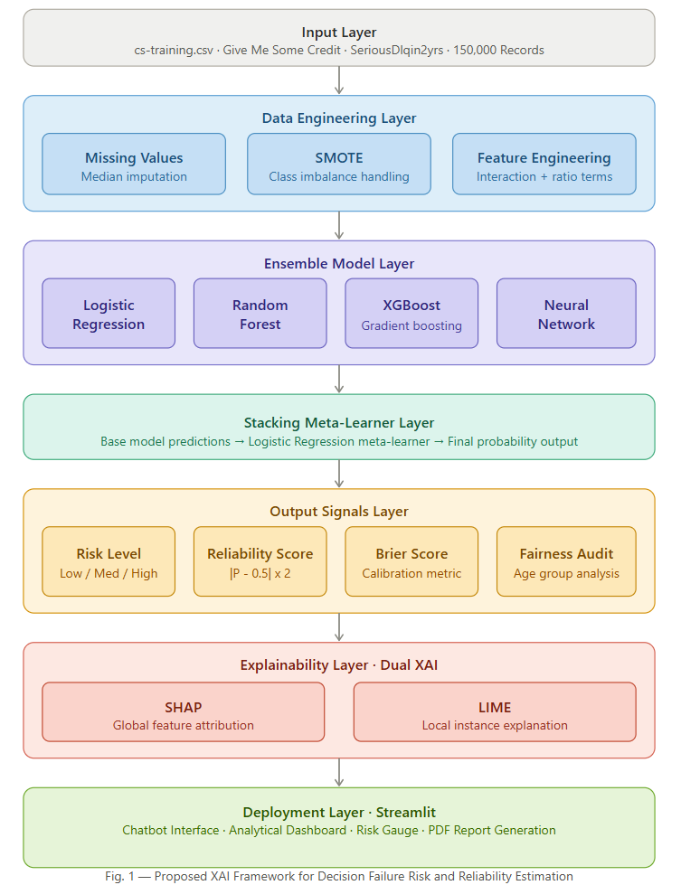
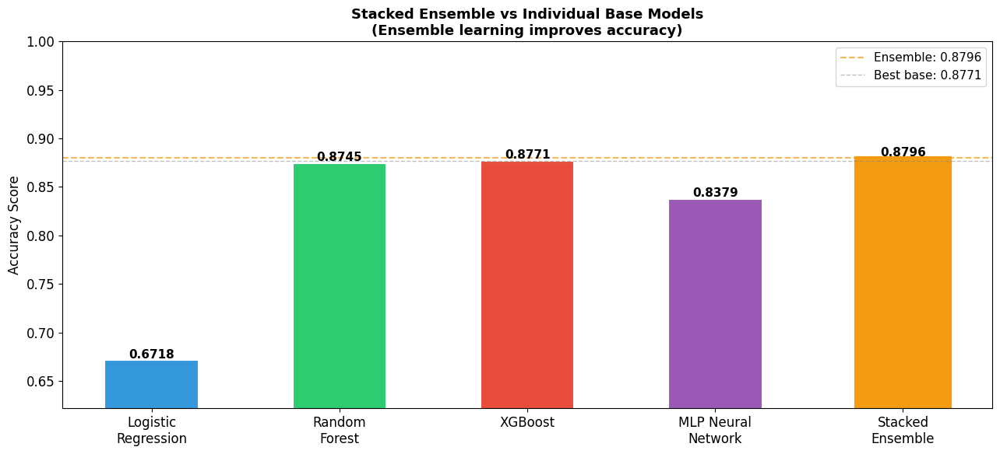
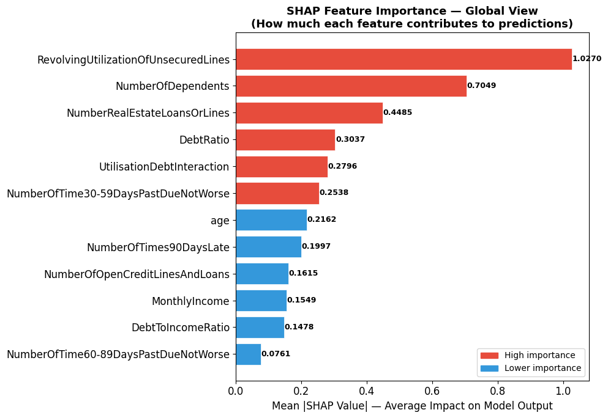
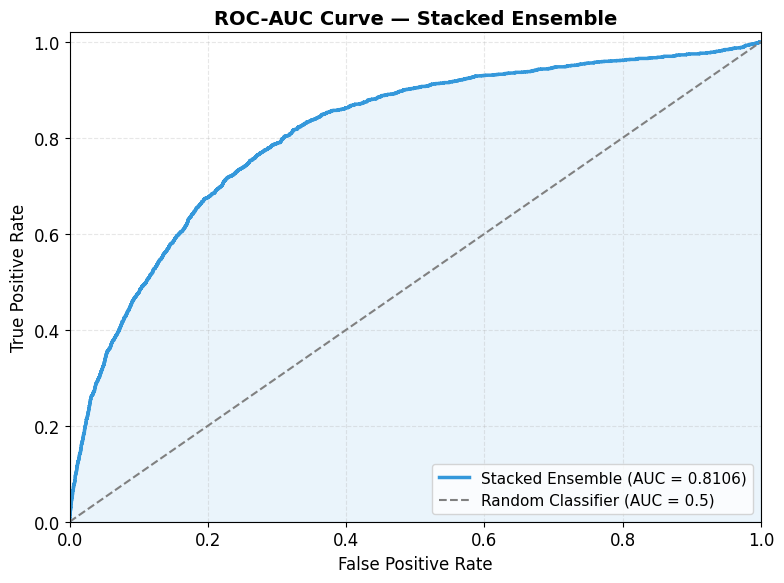
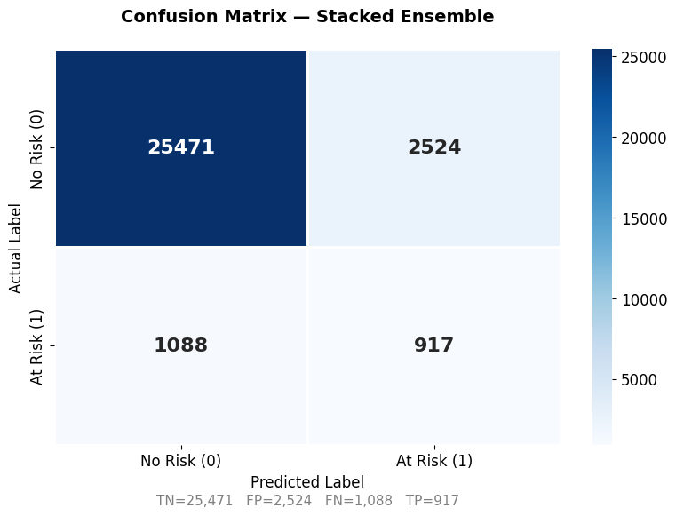
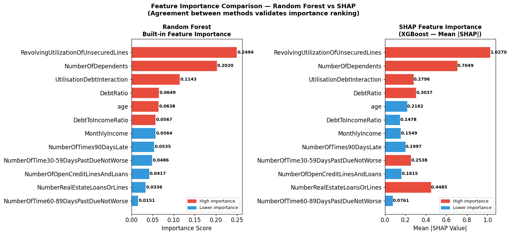

# Explainable AI Framework for Decision Failure Risk Estimation

> Stacked Ensemble Learning + Dual XAI (SHAP + LIME) + 
> Novel Reliability Scoring + Fairness Audit
> 
> BTech CSE — Semester IV Research Project
> Symbiosis Institute of Technology, Nagpur

---

## Overview

An end-to-end explainable AI system that predicts financial
credit default risk, explains every prediction using dual XAI
techniques, and quantifies prediction confidence through a
novel reliability scoring mechanism deployed as a live
interactive Streamlit application.

---

## The Problem

Traditional credit scoring systems predict risk but never
explain WHY. No transparency. No confidence measure.
No fairness evaluation. Our framework solves all three.

---

## Key Results

| Metric | Value |
|---|---|
| Accuracy | 87.96% |
| ROC-AUC (5-Fold CV) | 0.9515 ± 0.0209 |
| ROC-AUC (Test) | 0.8106 |
| Brier Score | 0.0877 |
| Mean Reliability Score | 0.8083 |
| Dataset Size | 150,000 records |
| Models Trained | 5 |
| Research Visuals | 23 |

---

## Model Performance Comparison

| Model | Accuracy |
|---|---|
| Logistic Regression | 67.18% |
| MLP Neural Network | 83.79% |
| Random Forest | 87.45% |
| XGBoost | 87.71% |
| **Stacked Ensemble** | **87.96%** |

---

## Three Key Innovations

### 1. Novel Reliability Score
 Reliability = |P − 0.5| × 2
Converts raw probability into a confidence score (0 to 1).
Automatically flags uncertain predictions for human review.
No existing credit scoring system provides this signal.

### 2. Dual XAI — SHAP + LIME
- **SHAP** — Global feature attribution across all predictions
- **LIME** — Local instance-level explanation per prediction
- Both methods independently validate top feature rankings
- Convergence between methods scientifically validates results

### 3. Fairness Audit

| Age Group | Accuracy |
|---|---|
| Under 30 | 80.13% |
| 30–40 | 82.18% |
| 40–50 | 85.12% |
| 50–60 | 88.49% |
| Over 60 | 94.72% |

---

## System Architecture



---

## Key Visuals

### Stacked Ensemble vs All Models


### SHAP Global Feature Importance


### ROC-AUC Curve


### Confusion Matrix


### RF vs SHAP Feature Importance Comparison


---

## Live Demo Results

| Profile | Risk | Probability | Confidence |
|---|---|---|---|
| 21y · $500 · max risk | 🔴 High | 0.8144 | 62.9% |
| 58y · $15k · perfect | 🟢 Low | 0.0212 | 95.8% |
| 42y · $5k · borderline | 🟡 Medium | 0.6701 | 34.0% |
| 32y · $20k · hidden risk | 🟡 Medium | 0.4544 | 9.1% |
| 70y · $2k · clean history | 🟢 Low | 0.0268 | 94.6% |

Demo 4 (9.1% confidence) automatically triggers human
review — the model flags its own uncertainty.

---

## Tech Stack

| Category | Tools |
|---|---|
| Language | Python |
| ML Models | Scikit-learn, XGBoost |
| XAI | SHAP, LIME |
| Imbalance | SMOTE (imbalanced-learn) |
| UI | Streamlit |
| Visualization | Matplotlib, Seaborn |
| Model Storage | Joblib |
| PDF Reports | FPDF2 |
| Dataset | Give Me Some Credit (Kaggle) |

---

## Dataset

**Give Me Some Credit** — Kaggle (2011)
- 150,000 borrower records
- Binary target: SeriousDlqin2yrs
- Class imbalance: 93:7 (handled with SMOTE)
- 11 original features + 2 engineered features

Download dataset:
https://www.kaggle.com/c/GiveMeSomeCredit/data

---

## How to Run Locally

### Step 1 — Clone the repository
```bash
git clone https://github.com/Harmansaini83/xai-risk-predictor.git
cd xai-risk-predictor
```

### Step 2 — Install dependencies
```bash
pip install -r requirements.txt
```

### Step 3 — Generate model files
- Download cs-training.csv from Kaggle link above
- Place it in the root folder
- Open and run notebook/XAI_Credit_Risk.ipynb completely
- This generates all pkl model files automatically

### Step 4 — Run the app
```bash
python -m streamlit run app1.py
```
Opens at http://localhost:8501

---

## Project Structure

# Project Structure

```text
xai-risk-predictor/
│
├── app.py                          # Streamlit application
├── requirements.txt               # All dependencies
├── README.md                      # Project documentation
├── RESEARCH.md                    # Research paper details
│
├── notebook/
│   └── XAI_Credit_Risk.ipynb      # Complete training pipeline
│
├── visuals/
│   ├── visual_08_ensemble_comparison.png
│   ├── visual_11_confusion_matrix.png
│   ├── visual_12_roc_curve.png
│   ├── visual_15_shap_global.png
│   ├── visual_20_system_architecture.png
│   └── visual_22_rf_vs_shap_importance.png
│
├── models/
│   ├── feature_names.pkl          # Feature names list
│   ├── feature_names.txt          # Human-readable features
│   ├── model_scaler.pkl           # StandardScaler
│   └── model_xgboost.pkl          # XGBoost base model
│
└── Note:
    Large model files (Random Forest 385MB, Stacked Ensemble 772MB)
    are excluded due to GitHub file size limits.
    Run the notebook locally to generate all model files.

---

## Future Scope

| Domain | Application | Status |
|---|---|---|
| Finance | Credit default prediction | ✅ Active |
| Healthcare | Patient readmission risk | 🔜 Planned |
| HR | Employee attrition | 🔜 Planned |
| Operations | Equipment failure | 🔜 Planned |

---

## Research

See [RESEARCH.md](RESEARCH.md) for paper details,
abstract, and key contributions.

---

## Authors

**Harman Saini**
BTech CSE — Symbiosis Institute of Technology, Nagpur
[harmanajitsinghsaini16@gmail.com](mailto:harmanajitsinghsaini16@gmail.com)

**Gitika Makheja**
BTech CSE — Symbiosis Institute of Technology, Nagpur

**Under the guidance of:**
Dr. Gagandeep Kaur
Department of CSE, Symbiosis Institute of Technology, Nagpur

---

## License

This project is for academic and research purposes.
